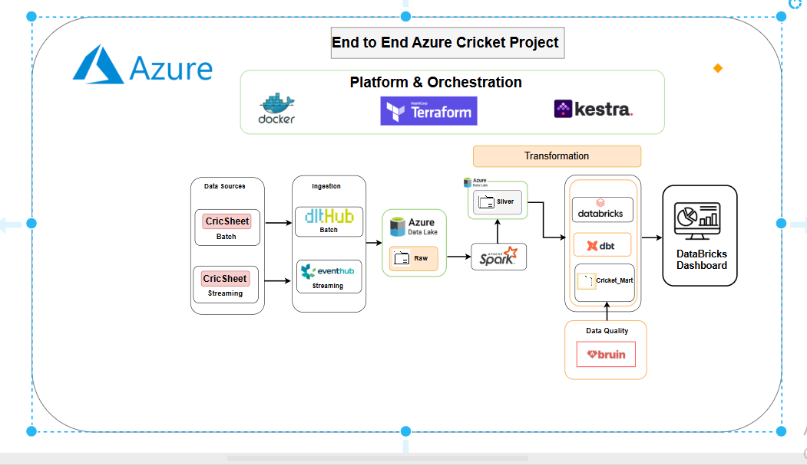

# End to End Azure Cricket Project

A complete, working data engineering pipeline built on Azure: cricket match
data flows from a free, unlimited data source through batch and simulated
streaming ingestion, gets transformed and modeled in Databricks, is
validated by an automated data quality gate, and lands in a published
analytics dashboard — all orchestrated end to end with Kestra.

**Live dashboard:** https://adb-7405607340327595.15.azuredatabricks.net/dashboardsv3/01f18f02ee2215a0bbefecbf1fc1289b/published?o=7405607340327595

## Architecture



Text version of the same flow:

```
Cricsheet (batch)  ──┐
                      ├─→ dltHub ──→ ADLS raw ──┐
Cricsheet (simulated  │                          │
  streaming)  ────────┘→ Event Hubs ──→ ADLS raw/streaming ──┐
                                                                │
                                                                ▼
                                                    Spark (Databricks)
                                                                │
                                                                ▼
                                                        ADLS silver
                                                                │
                                                                ▼
                                            Gold tables (Unity Catalog)
                                          batsman / bowler / team / over
                                                                │
                                          ┌─────────────────────┴───────────────┐
                                          ▼                                     ▼
                                Bruin (quality gate)              Databricks Dashboard
```

Orchestrated end to end by **Kestra**, running in **Docker**. Infrastructure
is provisioned with **Terraform**.


